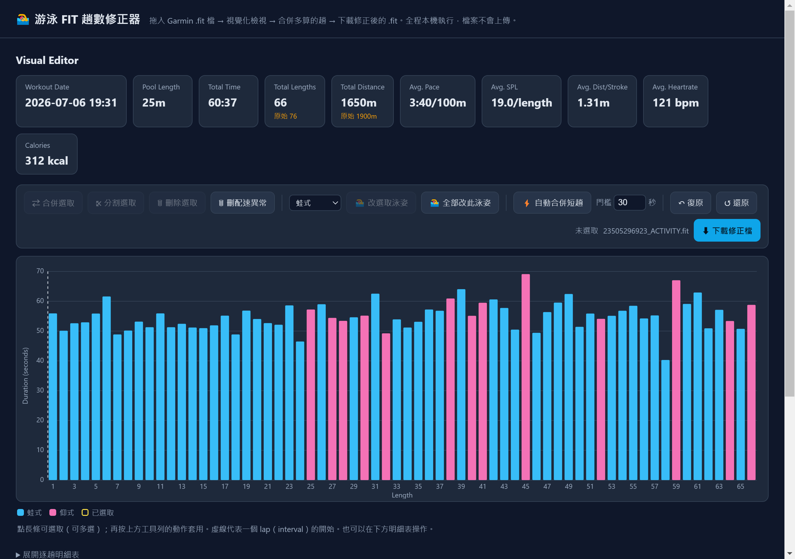
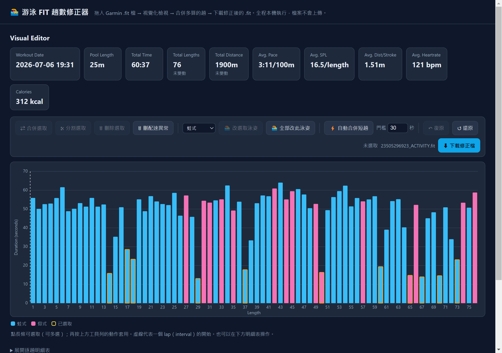
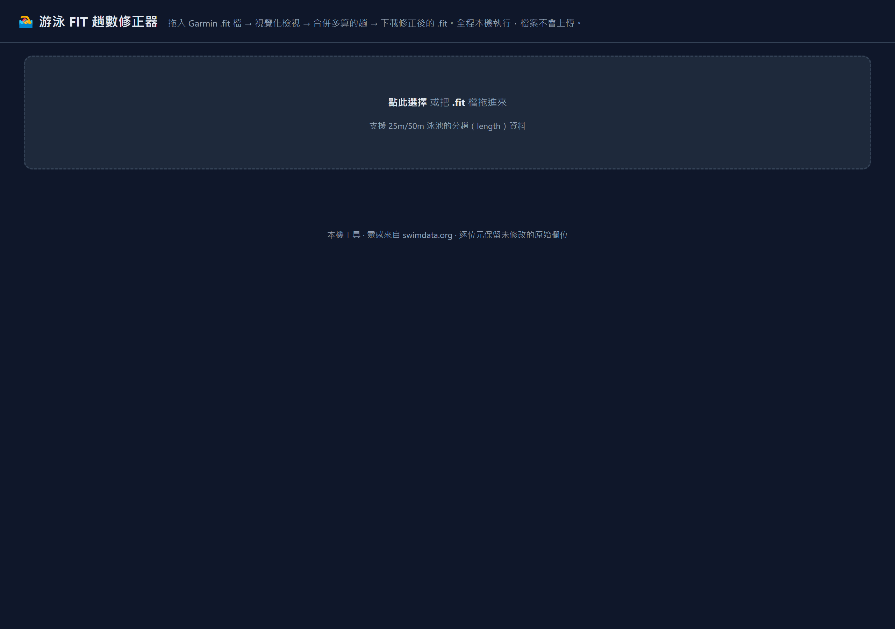
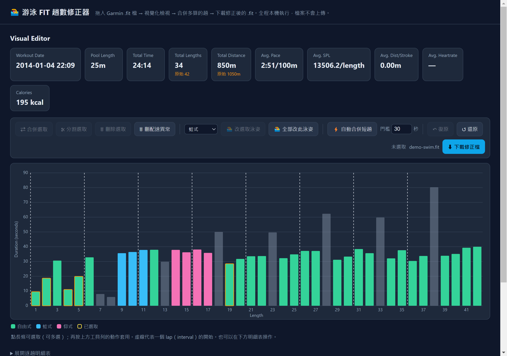
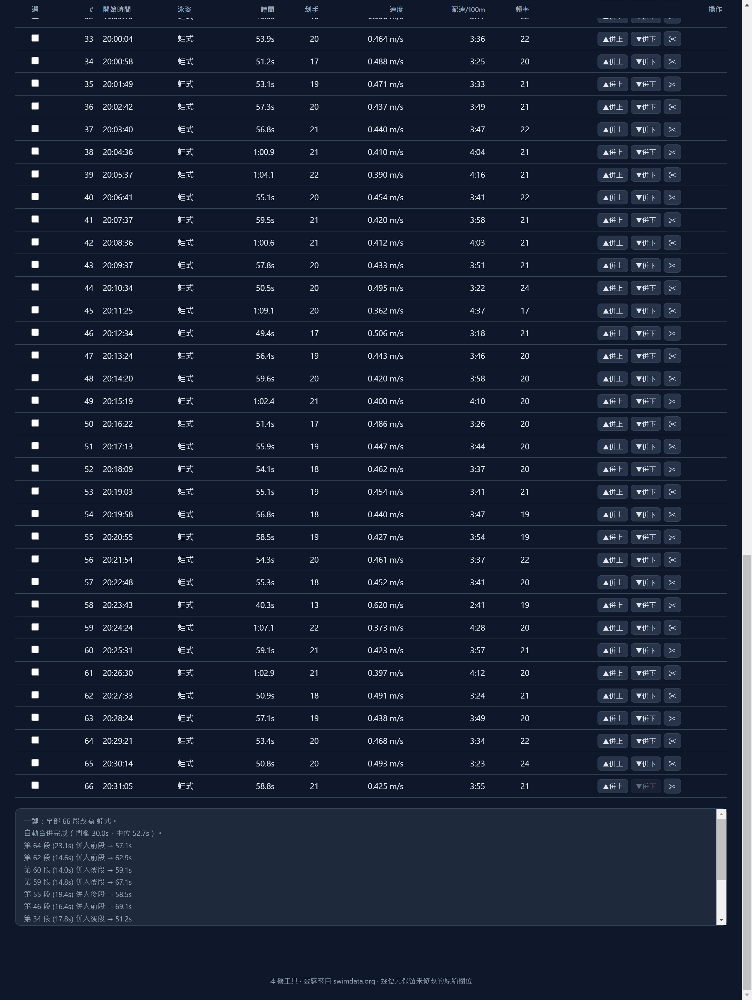
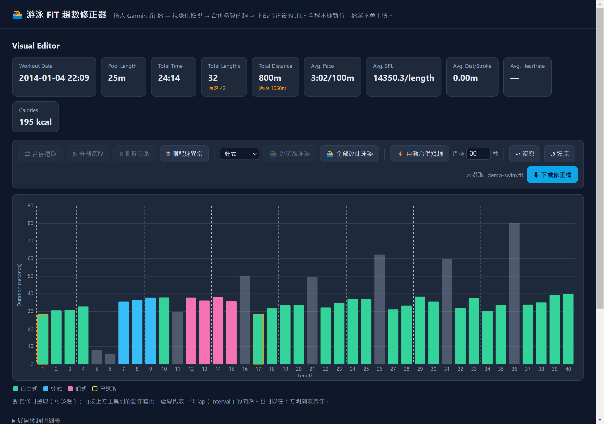
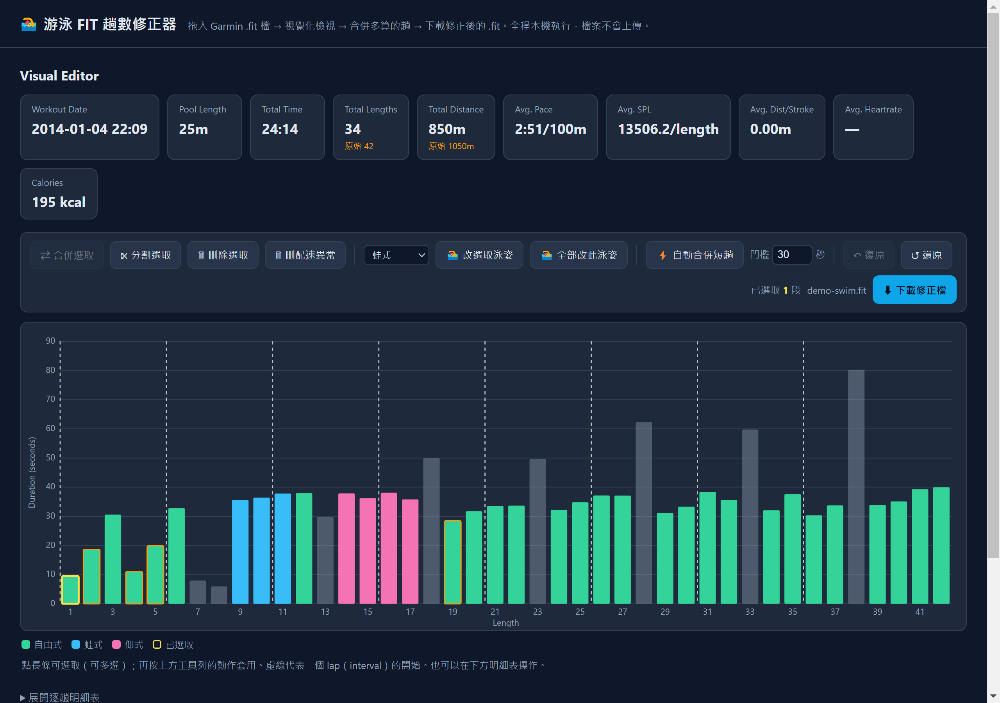
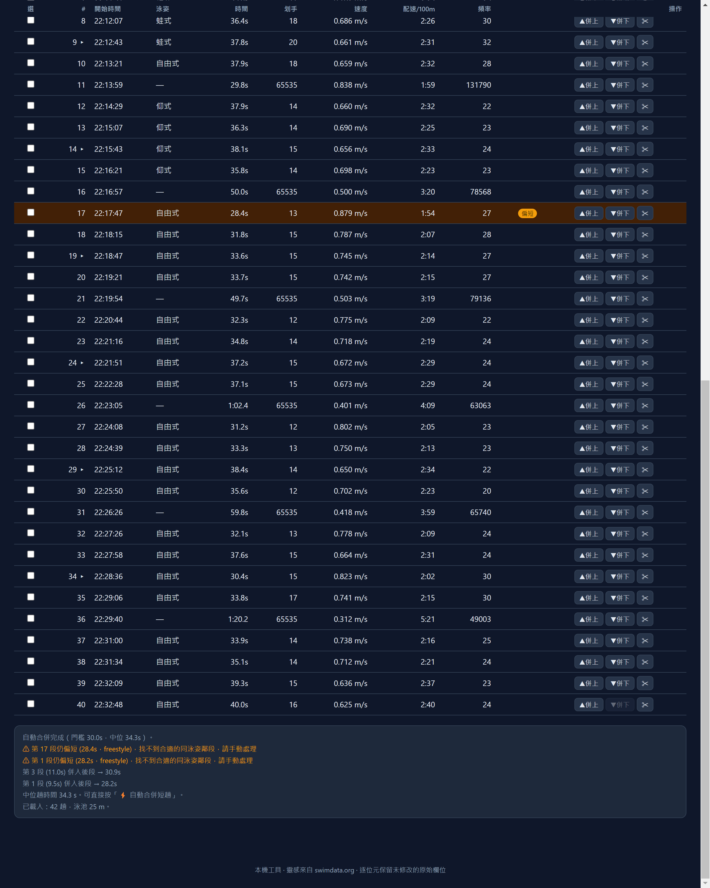
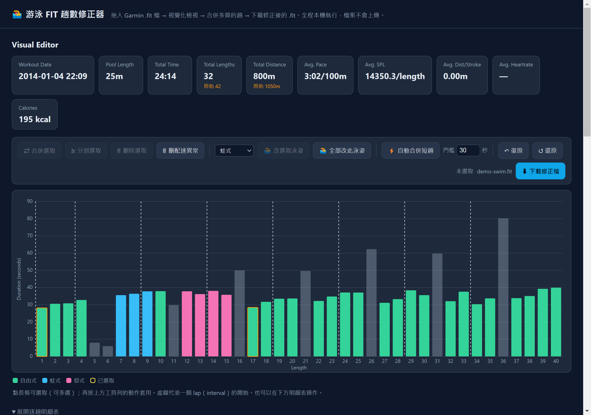

# 游泳 FIT 趟數修正器 — 使用說明

Garmin 游泳手錶在轉身時，有時會把**同一趟 25 m**誤判成「到達終點」，把一趟拆成兩筆記錄。結果是趟數與總距離被多算、單趟配速失真。本工具讓你在本機瀏覽器或桌面程式中，把這些被拆開的趟**合併回去**，重新計算速度與配速，並匯出可重新上傳 Garmin Connect / Strava 的修正版 `.fit`。

> **隱私：** 全程在本機執行，檔案不會上傳到任何伺服器。

---

## 自動合併功能 — 合併前後條狀圖

Garmin 手錶常在**轉身**時多記一趟：同一趟 25 m 被拆成「正常長條 + 一根很矮的短長條」。本工具的核心功能 **⚡ 自動合併短趟** 會把這些短趟併回相鄰的同泳姿趟次，**一鍵**修正趟數與距離。

**操作：** 載入 `.fit` → 按工具列 **⚡ 自動合併短趟**（門檻預設 30 秒）→ 下載 `_fixed.fit`

**條狀圖怎麼看：**

| 外觀 | 意義 |
|------|------|
| 高度與左右相近的長條 | 正常一趟 |
| **很矮**且帶 **橘色邊框** 的長條 | 可疑短趟（低於門檻） |
| 合併後短長條消失 | 已併入前／後鄰段，該趟時間變長 |

以下為實際游泳紀錄範例（`23505296923_ACTIVITY.fit`，25 m 泳池）。**同一區段**（約第 14 趟附近）合併前後對照：

| 合併前 — 多根橘框短長條 | 合併後 — 短趟消失、高度恢復正常 |
|:---:|:---:|
|  |  |

**整段訓練統計變化（按一次自動合併）：**

| 項目 | 合併前 | 合併後 |
|------|--------|--------|
| 有效趟數 | 76 | **66**（−10 趟） |
| 總距離 | 1900 m | **1650 m**（−250 m） |
| 總游動時間 | 60:37 | **不變** |
| 平均配速 | 3:11/100m | **3:40/100m**（更接近真實節奏） |

全貌條狀圖（合併前 76 根 → 合併後 66 根）：

| 合併前 | 合併後 |
|:---:|:---:|
|  |  |

> 總時間與划手數不變；減少的是多算出來的幽靈趟。更細的日誌與演算法說明見 [§5 自動合併短趟](#5-自動合併短趟)。

---

## 目錄

0. [自動合併功能 — 合併前後條狀圖](#自動合併功能--合併前後條狀圖)
1. [Release 發佈版下載](#1-release-發佈版下載)
2. [開始使用](#2-開始使用)
3. [載入檔案](#3-載入檔案)
4. [介面總覽](#4-介面總覽)
5. [自動合併短趟](#5-自動合併短趟)
6. [手動編輯](#6-手動編輯)
7. [逐趟明細表](#7-逐趟明細表)
8. [下載修正檔](#8-下載修正檔)
9. [桌面版（Electron）](#9-桌面版electron)
10. [常見問題](#10-常見問題)
11. [已知限制](#11-已知限制)

---

## 1. Release 發佈版下載

專案 [`release/`](https://github.com/b95901149/swimFitEditor/tree/master/release) 資料夾提供兩種預先打包好的版本，**一般使用者建議直接下載這裡的壓縮檔**，不必 clone 原始碼或執行 `npm install`。

| 檔案 | 類型 | 大小（約） | 下載 |
|------|------|------------|------|
| `SwimFitEditor-1.0.0-browser.zip` | **瀏覽器版**（免安裝） | ~17 KB | [下載](https://github.com/b95901149/swimFitEditor/raw/master/release/SwimFitEditor-1.0.0-browser.zip) |
| `SwimFitEditor-1.0.0-setup.zip` | **Windows 安裝版** | ~78 MB | [下載](https://github.com/b95901149/swimFitEditor/raw/master/release/SwimFitEditor-1.0.0-setup.zip) |

> 發佈檔對照說明亦見 [release/README.md](https://github.com/b95901149/swimFitEditor/blob/master/release/README.md)。

### 瀏覽器版 — 快速開始

適合：不想安裝軟體、偶爾修正、或磁碟空間有限。

1. 下載並解壓 `SwimFitEditor-1.0.0-browser.zip`
2. 雙擊 **`index.html`**（或 **`開啟.bat`**）用 Chrome / Edge / Firefox 開啟
3. 閱讀壓縮包內的 **`使用方式.txt`**（若有疑問）
4. 拖入 `.fit` 檔 → 編輯 → 下載 `_fixed.fit`

| | |
|---|---|
| ✅ 優點 | 免安裝、體積極小、功能與桌面版相同、全程本機 |
| ❌ 限制 | 無 `.fit` 檔案關聯；每次需用瀏覽器開啟 `index.html` |

### 安裝版 — 快速開始

適合：經常修正游泳紀錄、希望雙擊 `.fit` 直接開啟、需要桌面捷徑。

1. 下載並解壓 `SwimFitEditor-1.0.0-setup.zip`
2. 執行 **`SwimFitEditor Setup 1.0.0.exe`**
3. 依安裝精靈完成（可自訂安裝路徑）
4. 從桌面捷徑 **「游泳FIT修正器」** 啟動，或直接**雙擊 `.fit` 檔**

| | |
|---|---|
| ✅ 優點 | 桌面捷徑、`.fit` 檔案關聯、完整離線桌面體驗 |
| ❌ 限制 | 安裝檔較大（內含 Chromium 執行環境，約 78 MB 下載 / 安裝後約 270 MB） |

安裝後若 `.fit` 預設程式被 Garmin 軟體佔用，可在 Windows **設定 → 應用程式 → 預設應用程式 → 依檔案類型選擇預設值** 中改回 SwimFitEditor。

### 兩種版本如何選？

```
常偶爾用、不想裝軟體？  → 瀏覽器版（~17 KB）
常駐桌面、雙擊 .fit？    → 安裝版（~78 MB）
```

兩者使用相同的 `index.html` 引擎，修正結果一致。以下章節的操作說明**兩種版本通用**。

---

## 2. 開始使用

### 網頁版（免安裝）

若已下載 **Release 瀏覽器版**，解壓後開啟 `index.html` 即可。若從原始碼取得，則用瀏覽器直接開啟專案中的 `index.html`（雙擊即可，不需架設伺服器）。

> ⚠ 請勿在 IDE 內建預覽面板操作——沙箱環境無法正常跳出「選擇檔案」視窗。

### 桌面版

若已安裝 **Release 安裝版**，從捷徑或雙擊 `.fit` 啟動。開發者亦可執行 `dist-app/win-unpacked/SwimFitEditor.exe` 或自行 `npm run dist` 建置。詳見 [§9 桌面版](#9-桌面版electron)。

---

## 3. 載入檔案

啟動後會看到歡迎畫面：



**載入方式（擇一）：**

| 方式 | 操作 |
|------|------|
| 拖放 | 把 `.fit` 檔拖進虛線框 |
| 點選 | 點擊虛線框，從檔案選擇器挑選 |
| 桌面版關聯 | 雙擊 `.fit` 檔（需已安裝並設為預設程式） |

**支援的資料類型：** 泳池分趟游泳（lap swimming），含 `length` 訊息；泳池長度通常為 25 m 或 50 m（自動從 session 讀取）。

載入成功後，拖放區會隱藏，進入 **Visual Editor**：



---

## 4. 介面總覽

### 4.1 統計卡片

畫面上方一排卡片顯示本次訓練摘要：

| 欄位 | 說明 |
|------|------|
| Workout Date | 訓練開始時間 |
| Pool Length | 泳池長度（公尺） |
| Total Time | 總游動時間 |
| Total Lengths | 有效趟數；若與原始不同，會顯示「原始 N」 |
| Total Distance | 總距離 = 有效趟數 × 泳池長度 |
| Avg. Pace | 平均配速（/100 m） |
| Avg. SPL | 平均每趟划手數 |
| Avg. Dist/Stroke | 平均每划前進距離 |
| Avg. Heartrate | 平均心率（若原始檔有） |
| Calories | 卡路里 |

當你合併或刪除趟數後，**Total Lengths** 與 **Total Distance** 會即時更新，並標示與原始值的差異。

### 4.2 工具列


| 按鈕 | 功能 |
|------|------|
| ⇄ 合併選取 | 把選取的**相鄰**趟合併成一趟 |
| ⤪ 分割選取 | 把選取的每趟平均分成兩趟 |
| 🗑 刪除選取 | 刪除選取的趟（幽靈趟） |
| 🗑 刪配速異常 | 自動刪除配速不合理、明顯為幽靈的短趟 |
| 🏊 改選取泳姿 / 全部改此泳姿 | 套用左側泳姿下拉選單 |
| ⚡ 自動合併短趟 | 依門檻自動合併異常短趟（見 §4） |
| 門檻 N 秒 | 低於此秒數的趟視為「偏短」 |
| ↶ 復原 | 復原上一步 |
| ↺ 還原 | 回到剛載入時的原始資料 |
| ⬇ 下載修正檔 | 匯出 `檔名_fixed.fit` |

### 4.3 長條圖（Visual Editor）

- **橫軸：** 趟序（Length #1, #2, …）
- **縱軸：** 該趟耗時（秒）
- **顏色：** 泳姿（見圖例）
- **橘色邊框：** 偏短趟（低於門檻）
- **黃色邊框：** 已選取的趟
- **虛線：** 一個 lap（interval）的開始

**滑鼠操作：**

| 操作 | 效果 |
|------|------|
| 點擊長條 | 選取 / 取消選取（可多選） |
| Shift + 點擊 | 從上次錨點範圍選取 |
| 雙擊長條 | 將該趟平均分割成兩段 |
| 滑過長條 | 顯示浮動提示（時間、划手、配速等） |

圖例範例：自由式（綠）、蛙式（藍）、仰式（粉）、已選取（黃框）。

---

## 5. 自動合併短趟

多數誤判情境下，**先按「⚡ 自動合併短趟」** 即可處理大部分問題。

**演算法概要：**

1. 計算所有有效趟的**中位時間**（例如 53 s）。
2. 低於「門檻」（預設 30 秒）的趟視為可疑短趟。
3. 對每段短趟，在同泳姿的**前一段或後一段**中，找合併後時間最接近中位值者併入（預設偏向併入前段）。
4. 找不到合適鄰段的短趟會在下方日誌標示 ⚠，需手動處理。

### 5.1 實例：實際 Garmin 游泳紀錄（合併前後）

文首 [自動合併功能 — 合併前後條狀圖](#自動合併功能--合併前後條狀圖) 已展示同一區段與全貌的條狀圖對照；以下補充數據與日誌細節。示範檔：`fixtures/23505296923_ACTIVITY.fit`（2026-07-06、25 m 泳池、約 60 分鐘）。

| 項目 | 數值 |
|------|------|
| 有效趟數（合併前） | 76 |
| 總距離（合併前） | 1900 m |
| 中位趟時間 | 52.7 s |
| 低於 30 s 的趟 | 11 段 |
| 自動合併結果 | 併入 **10** 段 → **66 趟 / 1650 m** |

#### 日誌與操作

保持門檻 **30 秒**，按 **⚡ 自動合併短趟** 後，日誌區會列出每一筆合併（例如「第 14 段 15.9s 併入後段 → 51.2s」）：



> **說明：** 總游動時間（60:37）與划手數在合併後**不變**；減少的是多算出來的「幽靈趟」。

### 5.2 教學用示範檔

`fixtures/demo-swim.fit` 為較短的合成示範檔，適合快速熟悉介面：



統計卡片中的趟數、距離會更新；日誌區會列出每一筆合併紀錄與未解決的警告。

**調整門檻：** 若自動合併過於積極或保守，可修改「門檻」秒數後再執行一次（建議先 ↺ 還原再重試）。

---

## 6. 手動編輯

自動合併後若仍有問題，或你想精細調整，可用下列方式。

### 6.1 在長條圖上選取

點選要處理的長條（可多選）。相鄰的選取段才能使用「⇄ 合併選取」：



### 6.2 合併

- **合併選取：** 選取兩段以上相鄰趟 → 按 ⇄ 合併選取
- **併上 / 併下：** 在明細表（§6）對單趟使用 ▲併上、▼併下

合併時會把時間、划手數相加；泳姿與起始時間沿用留存的那一趟。**總游動時間與總划手數守恆。**

### 6.3 分割

- **分割選取：** 選取趟 → 按 ⤪，每趟平均分成兩段
- **雙擊長條：** 同上（平均分割）
- **明細表 ✂：** 可自訂第一段的秒數

### 6.4 刪除

- **刪除選取：** 移除幽靈趟（會減少總距離，請確認該段確實不應存在）
- **刪配速異常：** 批次刪除配速明顯不合理、且短於門檻的趟；執行前會跳出確認對話框

> **注意：** 若短趟其實是被拆開的**真實一趟**，應使用「合併」而非「刪除」。

### 6.5 修改泳姿

1. 在工具列泳姿下拉選單選擇目標泳姿
2. 選取要修改的趟 → 按「🏊 改選取泳姿」
3. 或按「🏊 全部改此泳姿」一次套用全部

### 6.6 復原與還原

| 按鈕 | 作用 |
|------|------|
| ↶ 復原 | 逐步還原編輯（最多 100 步） |
| ↺ 還原 | 一次回到剛載入檔案時的狀態 |

---

## 7. 逐趟明細表

點擊「**展開逐趟明細表**」可看到表格檢視，適合精確比對時間與配速：



| 欄位 | 說明 |
|------|------|
| 選 | 勾選框，與長條圖選取同步 |
| # | 趟序；▸ 表示 lap 開始 |
| 開始時間 | 該趟開始時刻 |
| 泳姿 | 自由式 / 蛙式 / 仰式 … |
| 時間 | 耗時 |
| 划手 | 划手數 |
| 速度 / 配速 / 頻率 | 衍生指標 |
| 標記 | **偏短**（橘）、**配速異常**（紅） |
| 操作 | ▲併上、▼併下、✂ 分割 |

畫面底部的**日誌區**會記錄載入、合併、警告等訊息，方便追蹤修改歷程。

---

## 8. 下載修正檔

確認趟數與距離正確後，按右上角藍色按鈕 **「⬇ 下載修正檔」**。

- 檔名格式：`原檔名_fixed.fit`（例如 `activity_fixed.fit`）
- 重新編碼時**只修改必要欄位**（每趟時間、划手、速度、message_index，以及 lap/session 總計）
- 其餘廠商專屬欄位（心率序列、裝置資訊等）從原始位元組保留，並重算 CRC

下載後可將 `_fixed.fit` 匯入 Garmin Connect 或上傳 Strava。



---

## 9. 桌面版（Electron）

除了瀏覽器開 `index.html`，專案也提供 Windows 桌面版：

```bash
npm install
npm start            # 開發模式
npm run dist         # 產生安裝檔
```

**桌面版額外功能：**

- 安裝後建立「游泳FIT修正器」桌面捷徑
- 註冊 `.fit` 檔案關聯（雙擊直接開啟）
- 完全離線、無網路連線

若同時安裝 Garmin 官方軟體，可在 Windows「開啟檔案的應用程式」中自行選擇 `.fit` 的預設程式。

---

## 10. 常見問題

### Q：載入後顯示「無法解析」？

- 確認檔案為 Garmin `.fit` 格式
- 開放水域（無 length 訊息）的游泳檔不支援
- 檔案若損毀，請從手錶或 Garmin Connect 重新匯出

### Q：自動合併後仍有 ⚠ 警告？

表示該短趟**找不到同泳姿、合併後時間合理的鄰段**。請在長條圖或明細表手動選取後合併，或檢查泳姿是否標錯。

### Q：合併後總距離變少了，正常嗎？

若原始檔多算了幽靈趟，修正後距離**應該**變少並接近實際游量。若反而覺得太少，請用 ↺ 還原後重新檢視。

### Q：瀏覽器與桌面版結果一樣嗎？

是，兩者使用相同的 `index.html` 引擎，行為一致。

### Q：該下載瀏覽器版還是安裝版？

見 [§1 Release 發佈版下載](#1-release-發佈版下載)。簡言之：偶爾用選瀏覽器版（~17 KB）；要雙擊 `.fit` 選安裝版（~78 MB）。

### Q：會上傳我的資料嗎？

不會。所有解析與編輯都在你的電腦上完成。

---

## 11. 已知限制

- 僅支援**泳池分趟游泳**（含 length 訊息）；開放水域不適用
- 自動合併為啟發式演算法，極端資料可能需手動微調
- 距離計算：有效趟數 × 泳池長度（不處理非標準泳池特殊規則）

---

## 附錄：示範資料

| 檔案 | 用途 |
|------|------|
| `fixtures/23505296923_ACTIVITY.fit` | **真實游泳紀錄範例**（§5.1 合併前後截圖所用） |
| `fixtures/demo-swim.fit` | 合成短檔，快速熟悉介面 |
| `fixtures/sample-swim.fit` | 公開測試向量原始檔 |

重新產生說明截圖（需先放好範例 FIT）：

```bash
node scripts/prepare-demo-fit.js
npm run docs:shots
```

示範原始檔來源：[ThomasKuehne/FIT-test-files](https://github.com/ThomasKuehne/FIT-test-files)（`sample-swim.fit`）。

---

*本說明由專案自動截圖腳本產生畫面，最後更新：2026-07-07*
